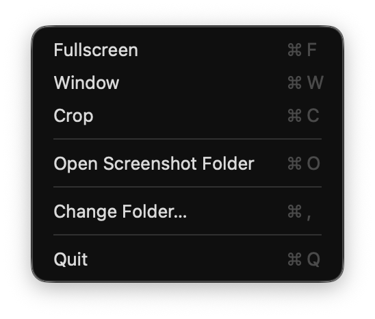

## 📸 ScreenShot — App for macOS Tahoe 26

**ScreenShot** is a lightweight macOS **menu bar app** for **Tahoe 26**, letting you take instant screenshots directly from your menu bar .

---

## 🚀 Features

- 📸 Fullscreen, window, and cropped screenshot options  
- 📋 Automatically copies screenshot to clipboard  
- 📁 Choose your screenshot folder on first launch  
- 🧼 Simple interface — no unnecessary menus or complexity  

---

## ✅ Compatibility

- macOS **Tahoe 26** (Apple Silicon)

---

## 📦 Installation

1. Download [`ScreenShot.dmg`](https://github.com/ExTV/screenshot-menu-bar-app/raw/main/ScreenShot.dmg)
2. Open it and **drag `ScreenShot.app` into the Applications folder**  
3. Launch the app from Launchpad or Spotlight  
4. First launch will prompt you to select a screenshot folder  
5. Done! You’ll now see a camera icon in your menu bar

---

## ✨ Screenshot

---

## 📄 License

MIT — see [LICENSE](LICENSE) for details.
